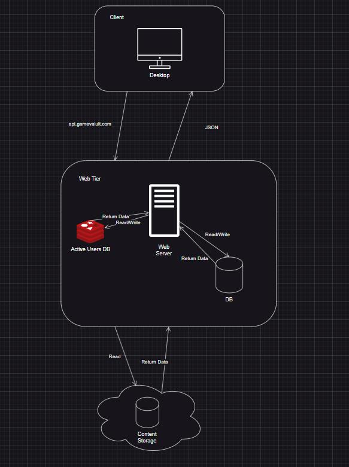
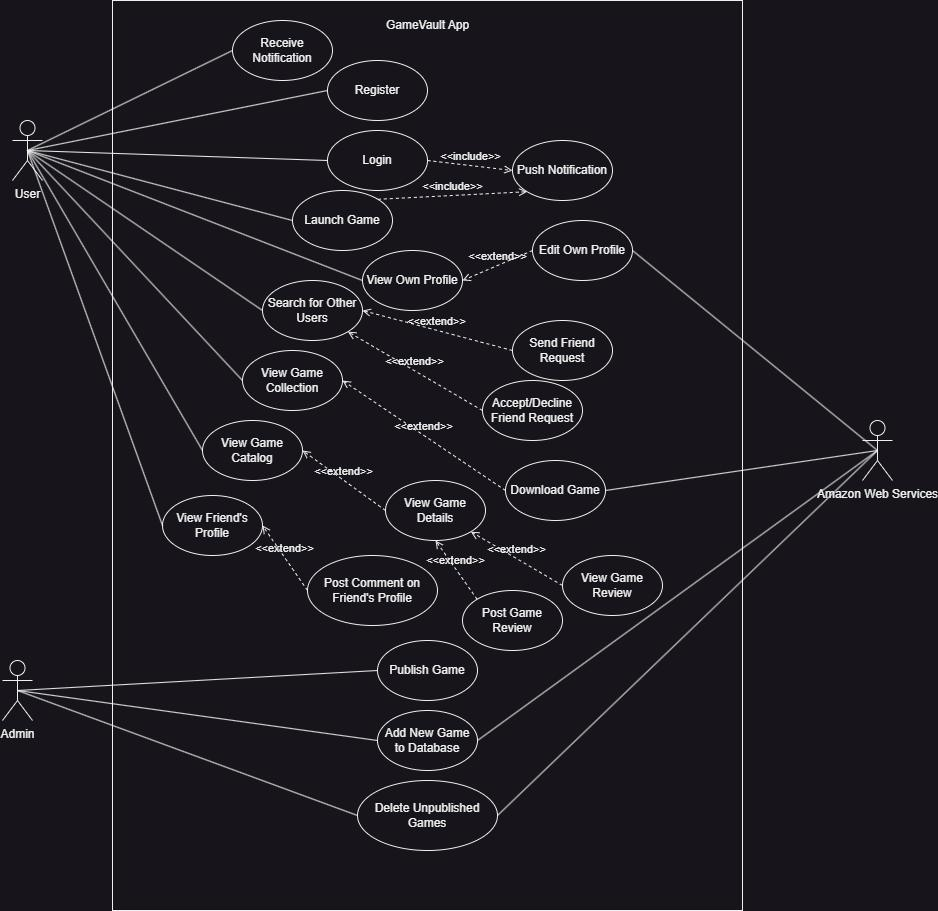
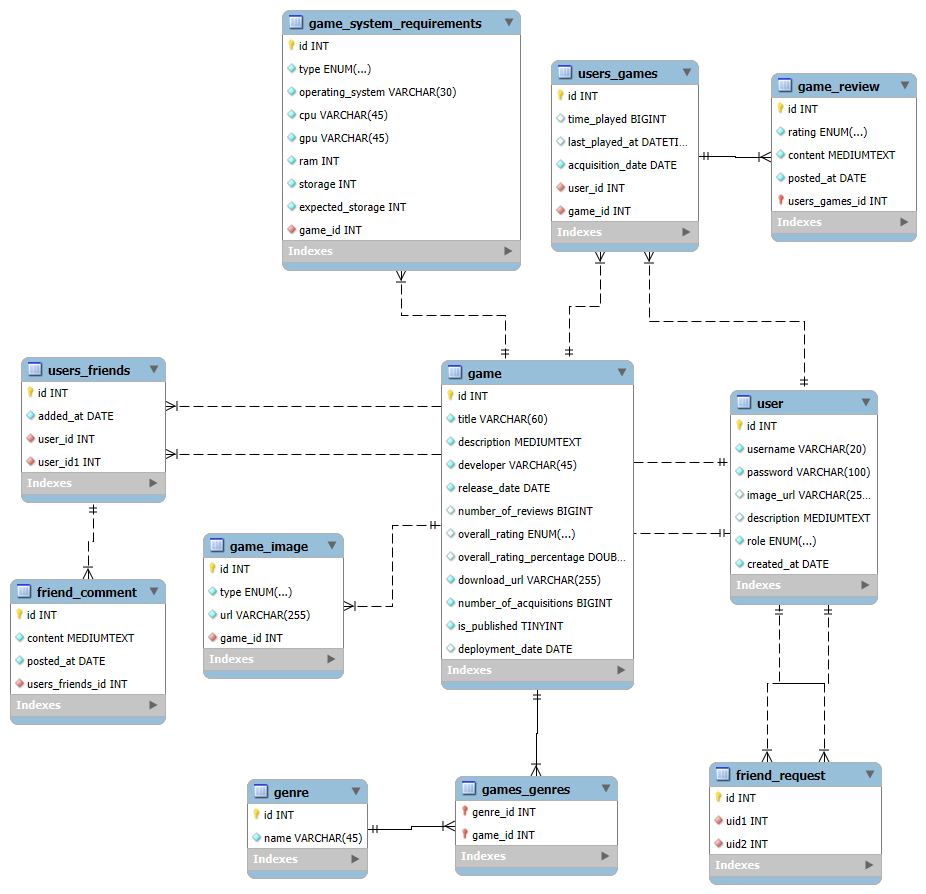

# GameValut Backend Documentation

## Table of Contents
- [Features](#features)
- [Architecture](#architecture)
  - [Presentation Layer](#presentation-layer)
  - [Server Layer](#server-layer)
  - [Data Management](#data-management)
- [Use Case Diagram](#use-case-diagram)
- [Database Design](#database-design)
- [Notifications](#notifications)
- [Representative Flows](#representative-flows)
- [API Testing with Postman](#api-testing-with-postman)

## Features

The main goal of GameVault is to give users an experience similar to real gaming platforms.
After registering or logging in, users gain access to a catalog of games stored in the database.
Each game has its own page with details such as description, screenshots, system requirements, and player comments, along with a list of friends who also own the game.

On their profile, users can view their personal game collection, including total playtime, last played date, and friends who own the same titles.
When a game is launched, the app automatically tracks playtime and updates user statistics.
Games can be downloaded and played directly through the platform — one of its core features.

Users can search for others on the platform, send and manage friend requests, and interact by leaving comments on profiles.
Each profile includes a username, avatar, description, friends list, owned games, and comments from others.
Users can also edit their profile details, change their avatar, and update their username or bio.

The notification system keeps users informed in real time — when a friend logs in, sends a friend request, or starts playing a game.
Notifications are active only while the user is online, creating a more authentic and dynamic experience.

Administrators manage the platform’s content through a dedicated admin panel.
They can add and publish new games, making them available to all users and keeping the catalog continuously growing.

## Architecture

The application is organized into two main layers.

### Presentation Layer
This layer includes the client applications through which users interact with the system.
There are two separate clients:

The Desktop Client ([petaaar88/gamevault-desktop-client](https://github.com/petaaar88/gamevault-desktop-client)), built with JavaFX, serves as the main application for end users.

The Admin Client ([petaaar88/gamevault-admin-client](https://github.com/petaaar88/gamevault-admin-client)), developed in ReactJS, is used for adding new games.

Both clients share the same purpose — displaying data received from the server and sending new requests when users perform actions.

### Server Layer
The backend is implemented in Java using the Spring Boot framework.
It handles all requests, processes business logic, and manages communication with both the database and object storage.
Clients communicate with the server via the HTTP protocol, while real-time notifications are delivered using the STOMP protocol over WebSocket connections.
This allows users to receive live updates — for example, when a friend logs in or sends a friend request.

### Data Management
The system uses two types of databases:

MySQL — stores core application data such as users, games, friendships, and comments.

Redis — serves as a cache for currently active users, improving performance and enabling real-time notifications.

Additionally, the application uses object storage for large files, including compressed game packages, game images, and user profile pictures.
This part is powered by Amazon Web Services (AWS) S3, providing secure and reliable file storage.

## Use case diagram

Use Case Diagram illustrates all key activities that users and administrators can perform within the application.
It provides a clear overview of the system, showing relationships between users, administrators, and core functionalities.
This helps visualize how different parts of the platform interact and makes it easier to understand the overall system behavior in practice.

## Database design

The database for this application contains several entities connected through different types of relationships.
Each entity represents a class in the code and defines how data is structured and related within the system.

The User entity is one of the most important — it stores information such as username, password, description, user role, profile picture, and account creation date.
It is linked to the games a user owns through the AcquiredGameCopy entity and is also connected to friend requests, friendships, and comments received or posted by the user.

The Friendship entity represents a connection between two users who have become friends. It records the date when the friendship was created and is linked to the FriendComment entity, which allows friends to leave comments on each other’s profiles. Similarly, the FriendRequest entity handles sending and receiving friendship requests between users.

The Game entity stores all information related to a game, such as title, release date, description, developer, download URL, rating, and number of downloads.
Each game can have multiple images stored in the GameImage entity, belong to different genres through the Genre entity, and include system requirements defined in the GameSystemRequirements entity.

The relationship between users and games is established through the AcquiredGameCopy entity, which tracks when a user downloaded a game, last played it, and how much total time they spent playing.
This allows the application to display detailed statistics for each game in a user’s collection.
Additionally, AcquiredGameCopy can be linked to GameReview, where users share their opinions and reviews about the games they’ve played.

## Backend Architecture

The backend follows a layered architecture, meaning the system is divided into clear, independent parts, each serving a specific purpose.
This structure improves code readability, maintainability, and scalability.

### Controller Layer
The controller layer handles incoming API requests from clients.
It does not contain business logic — its main role is to pass the request to the service layer and return the response to the user.

### Service Layer
This layer contains the business logic of the application.
It defines what happens when a user triggers a specific action — for example, downloading a game or adding a new friend.
The service layer decides how these operations are processed and interacts with the repository layer as needed.

### Repository Layer
The repository layer manages communication with the database.
It provides methods for storing, deleting, and retrieving data, using Spring Data JPA to simplify database operations.

In addition to these three core layers, the backend includes several supporting packages:

- **Model** — contains entities and DTO classes. Entities represent database objects, while DTOs handle data transfer between layers.
- **Exception** — centralizes error handling, defining custom exceptions and the system’s response to them.
- **Security** — manages authentication and authorization, controlling access to protected resources.
- **Config** — includes application configuration, such as database connections and service setup.
- **Utils** — provides helper classes and reusable methods used across different parts of the system.

## Security Design

Application security is implemented using Spring Security and JWT (JSON Web Tokens).
The goal was to make the system both secure and simple to use — once a user logs in, they receive a token that grants access to all protected resources.
Each token is valid for 24 hours and contains the username and user role, allowing the server to identify who made the request and what actions that user is authorized to perform.

### Security Configuration
The main security setup is defined in the SecurityConfig class, which specifies the filter chain executed before each request reaches the application.

CSRF protection is disabled because the system uses token-based authentication instead of session-based login.

CORS is configured to allow communication between the backend and different clients — such as the JavaFX desktop client and ReactJS admin panel.

The system operates in a stateless mode, meaning the server does not store session data; every request is authenticated based solely on the validity of the token.

### Authentication Process
When a user sends credentials to the `/login` endpoint, the system verifies them.
If valid, a JWT token is generated and returned to the user, who must then include it in the Authorization header for subsequent requests.
The token includes the username and role, allowing the server to authorize actions based on user privileges.

### Token Validation
The `JwtAuthenticationFilter` runs for every request, checking for the Authorization header and validating the token.
If the token is valid, the filter creates an authentication object and stores it in the security context, enabling the application to recognize the user.
If the token is invalid or expired, the request is rejected.

### User Loading & Password Encryption
The `CustomUserDetailsService` class handles user loading from the database.
It retrieves a user by username and maps it to a UserPrincipal implementing the UserDetails interface, allowing Spring Security to process authentication and roles correctly.
Passwords are encrypted using `BCryptPasswordEncoder`, ensuring they are never stored in plain text.

### Authorization
Access control is managed in `SecurityConfig`, where routes are restricted by user roles.
For example, endpoints for adding or publishing games are available only to administrators, while regular users can browse and add games to their collections.
Additionally, annotations such as @PreAuthorize are used above methods to further restrict access based on user roles.

## Notifications
The application uses STOMP over WebSocket to deliver real-time notifications between users.
This allows the system to instantly notify players when friends come online, send friend requests, or start playing a game — providing a more interactive and connected user experience.

### STOMP Endpoint

The WebSocket connection is established at `/ws`, with a SockJS fallback for clients that do not support native WebSocket connections.

The communication is handled using Spring’s built-in STOMP message broker.

### Topics

`/user-online-notification/{userId}` — notifies all online friends when a user comes online.

`/friend-request-notification/{userId}` — sends a notification to a specific user when they receive a new friend request.

`/friend-entered-game-notification/{userId}` — alerts friends when someone starts playing a game.

### Publishing Messages
Notifications are published from the backend using the `SimpMessagingTemplate`, which provides a convenient API for sending messages to specific destinations (topics).
Service classes responsible for handling user status, friend requests, and game sessions use this template to trigger updates in real time.

### Security and Access Control
WebSocket connections are secured using JWT tokens, which are validated during the handshake phase.

### Client Integration
JavaFX Desktop Client use SockJS and STOMP.js to connect, subscribe to topics, and display notifications dynamically within the user interface.

## Representative Flows
- Login/Register: client submits credentials → service authenticates/creates user → returns JWT → subsequent requests carry `Authorization: Bearer <JWT>`
- Send Friend Request: user A calls request API → service validates states → persists request → notifies target user on `/friend-request-notification/{userId}`
- Start Playing: user triggers launcher → service records play state → notifies online friends on `/friend-entered-game-notification/{userId}` with game title
- Admin Publish Game: admin creates game metadata and assets → adds system requirements and images → calls publish endpoint → game moves from unpublished to public listings

## API Testing with Postman
You can import the full Postman collection to test API endpoints.

[Postman collections](https://github.com/petaaar88/gamevault-backend/postman)
